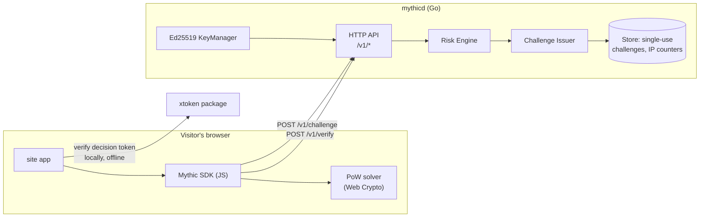

# Architecture

Mythic is a small set of moving parts held together by one invariant:
**the decision is always made server-side.**

## Components



| Component | Package | Responsibility |
|---|---|---|
| HTTP API | `server/internal/api` | Challenge/verify endpoints, middleware (request id, logging, recovery, CORS, per-IP limiting) |
| Risk engine | `server/internal/risk` | Deterministic weighted scoring → score 0–100 → decision + next difficulty |
| Challenge issuer | `server/internal/challenge` | Hashcash-style SHA-256 challenges; solution validation; plausibility floors |
| Key management | `server/internal/crypto` | Ed25519 generation/persistence, token signing |
| Store | `server/internal/store` | Single-use challenge registry + per-IP counters (in-memory v0, Redis planned) |
| Origin verification | `server/xtoken` | Public package: parse/verify decision tokens with no dependency on the server runtime |

## Request lifecycle

1. **`POST /v1/challenge`** — the SDK sends the site key and *advisory* hints.
   The API counts the request against the per-IP window, then the risk engine
   scores the request (pressure, hints) and picks the next PoW difficulty.
   Denied traffic stops here with `403`.
2. **PoW solving** — the SDK searches for a nonce making
   `SHA-256(id:salt:nonce)` start with `difficulty` zero bits. Expected cost at
   difficulty *d* is `2^d` hashes (~262k at the default 18 ≈ a second in a
   worker; millions per second on a GPU farm — which is exactly the point:
   the farm pays, scaled across every request).
3. **`POST /v1/verify`** — the challenge is consumed **atomically and
   single-use**; the solution is checked; the *server-measured* solve time is
   compared against the plausibility floor for the difficulty. The engine
   rescored the request; allow/challenge traffic gets an Ed25519-signed
   decision token, deny traffic gets `403`.
4. **Origin verification** — the protected backend verifies the token against
   the public key (fetched once from `jwks.json`) *locally*: signature, expiry,
   site key, decision. No round-trip to Mythic.

## Crypto design

- **Tokens**: `base64url(json(payload)) + "." + base64url(ed25519_sig)`.
  Claims: version, site key, decision, risk score, key id, jti, iat, exp
  (default TTL 5 min — configured, never longer than the challenge TTL).
- **Key rotation**: keys carry a `kid` (SHA-256 of the public key, truncated);
  the JWKS endpoint advertises the active key. Multi-key JWKS is the planned
  mechanism for zero-downtime rotation.
- **Seeds**: the Ed25519 seed is generated at first start and written to
  `MYTHIC_KEY_FILE` with `0600`. Seeds are git-ignored (`.gitignore` blocks
  `*.seed` and `data/`).

## Trust boundaries

```
untrusted                semi-trusted                trusted
────────────────────────────────────────────────────────────────
browser / SDK  ──advisory signals──▶  risk engine  ──▶  decision
   (hostile)        (weight-capped,     (server)        (signed)
                     never decisive)
```

Anything arriving over the wire is adversarial input: JSON is size-capped,
challenges are single-use, per-IP pressure is counted server-side, and client
hints carry bounded weight (ADR-0004).

## Scaling path (planned, not built)

| Concern | v0 | Planned |
|---|---|---|
| Store | in-process memory | Redis (single-use `SET NX EX`, sliding-window counters) |
| Keys | single active | multi-key JWKS rotation |
| Signals | server-observed + advisory hints | behavioral biometrics, TLS/JA4+ fingerprint, IP reputation |
| Scoring | deterministic rules | rules + learned model with feedback loop |
| Deployment | single binary | horizontally scaled behind proxy; store is the shared state |

## Repository layout

```
server/
├── cmd/mythicd/     entrypoint: config from env, graceful shutdown
├── internal/api/      HTTP handlers + middleware
├── internal/challenge/  PoW definition, validation, plausibility floor
├── internal/config/   environment configuration
├── internal/crypto/   Ed25519 key manager, token signing
├── internal/risk/     scoring engine + decision policy
├── internal/store/    store interface + in-memory implementation
└── xtoken/            public origin-side token verification
```
